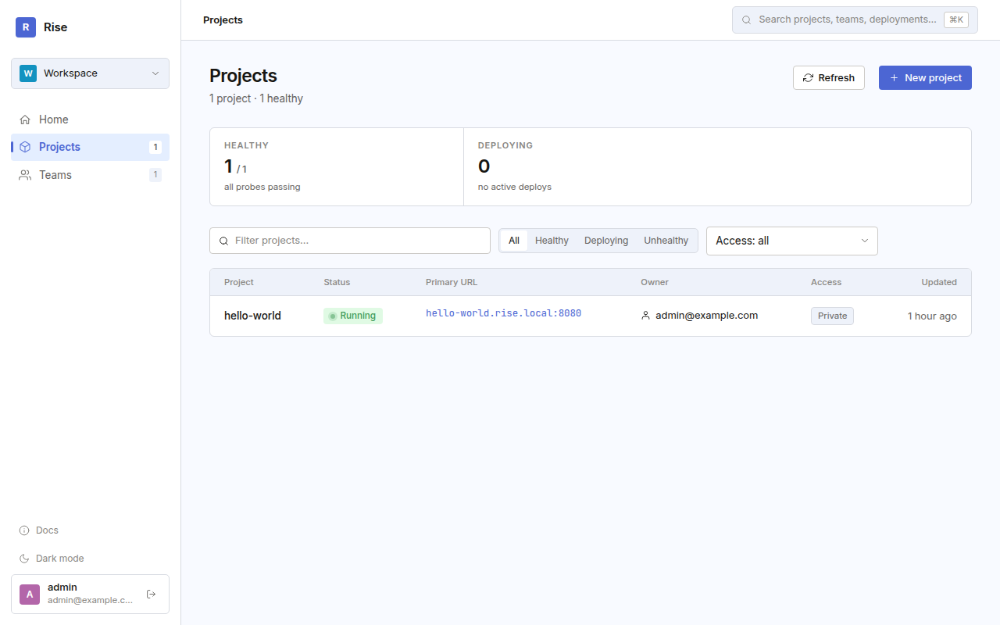
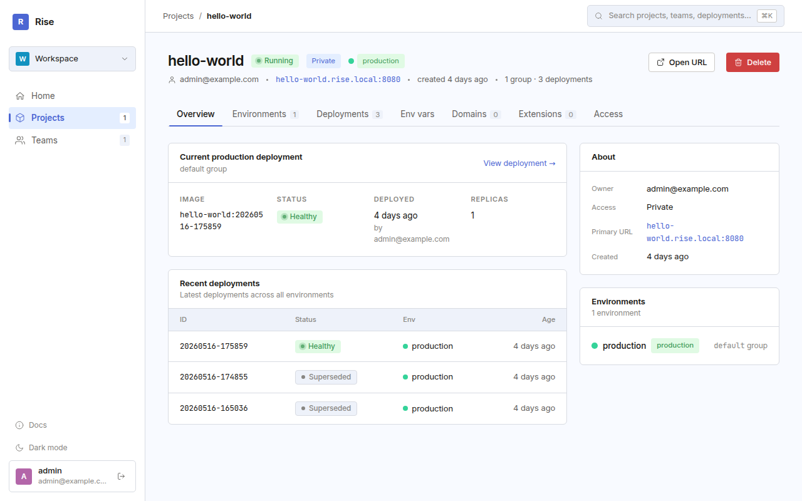
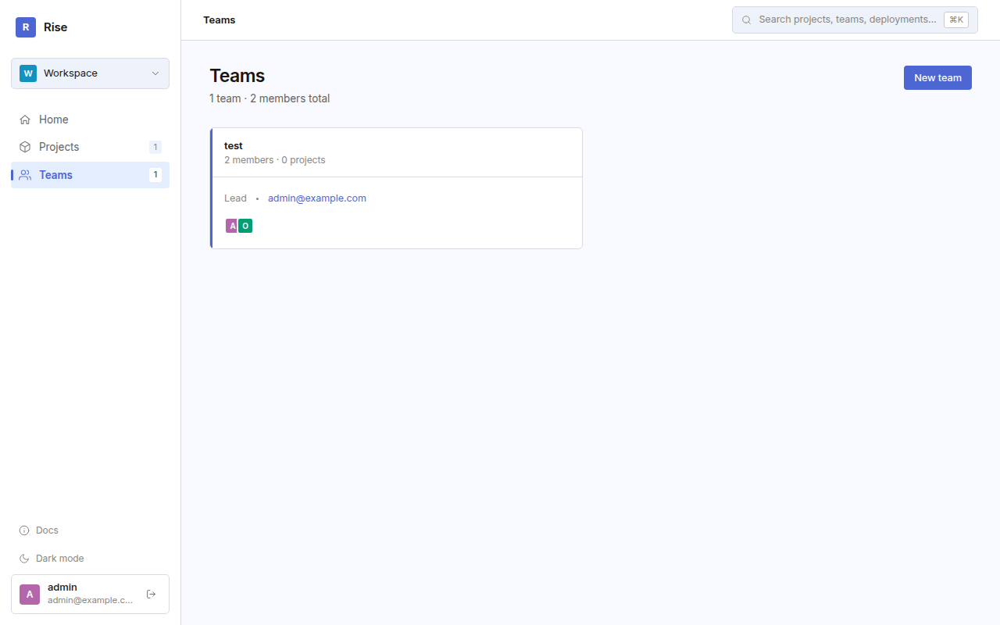

# Rise  

<p align="center">Rise is a Kubernetes-based platform for deploying containerized apps via a simple CLI and web dashboard.</p>
<p align="center"><small><em>DISCLAIMER: Rise is an early work-in-progress project that mostly uses AI-generated code.</em></small></p>

<p align="center">
  
</p>
<p align="center">
  
  
</p>

[Go to Documentation → ](https://niklasrosenstein.github.io/rise/)

## What is Rise?

  [pack]: https://buildpacks.io/docs/for-platform-operators/how-to/integrate-ci/pack/
  [railpack]: https://railpack.com/

Rise simplifies container deployment by providing:

- **Simple CLI** for building and deploying apps
    - **Buildpack support** with [pack] and [railpack]
    - **Enterprise ready** with support for corparate MITM proxies (handles `SSL_CERT_FILE` and `HTTPS_PROXY` forwarding)
- **Web dashboard** for monitoring deployments
- **Project & Team Management**: Organize apps and collaborate with teams
- **OAuth2/OIDC Authentication**: Secure authentication for Rise and deployed apps
- **Multi-tenant projects** with team collaboration
- **Automatic OCI repository provisioning**: Push images to AWS ACR with secure temporary credentials without per-project infrastructure setup
- **Service Accounts**: Workload identity for GitHub Actions, GitLab CI, etc. to deploy from CI/CD

## Install CLI from crates.io

```bash
# Install the CLI and backend from crates.io
cargo install rise-deploy

# Verify installation
rise --version
```

Note that this does not include server code unless you use `--features cli,server`.

## Local Development

### Prerequisites

- Docker and Docker Compose
- Rust 1.91+
- [mise](https://mise.jdx.dev/) (recommended for development)

### Start Services

```bash
direnv allow
# or else use `. .envrc`

# Install development tools
mise install

# One-time host setup (requires sudo)
mise setup:hosts
mise setup:docker

# Terminal (1): Start Minikube
mise minikube:up

# Terminal (2): Start the frontend
mise frontend:dev

# Terminal (3) Start the backend (will also start required containers with docker compose)
mise backend:run
```

Services will be available at:
- **Rise server**: http://localhost:3000
- **PostgreSQL**: localhost:5432
- **Minikube HTTP/HTTPS Ingress**: http://localhost:8080, https://localhost:8443
- **Vite.js Frontend Server**: http://localhost:5731

You may also need to add entries for deployed projects to `/etc/hosts`:

```
127.0.0.1 {project}.rise.local # One for each Rise-deployed project you want to access
```

**Default credentials**:
- Email: `admin@example.com`, `dev@example.com` or `user@example.com`
- Password: `password`

## Deploy your first app

```bash
# Build the CLI
cargo build
# `rise` binary should be available from direnv, otherwise use `cargo run`

rise login # Add --url http://rise.local:3000 if you've logged into another backend before

cd examples/hello-world
rise project create hello-world
rise deploy
```

## Releasing

**Prerequisites:**
- [GitHub CLI (`gh`)](https://cli.github.com/) - authenticated via `gh auth login`
- [Claude CLI](https://github.com/anthropics/anthropic-tools) - for AI-generated release notes (optional)

**Create a new release:**

```bash
# Preview release notes
./scripts/tag-version.sh --dry-run 0.14.0

# Create and publish release
./scripts/tag-version.sh 0.14.0
```

The script validates prerequisites, generates release notes, shows a plan, and after confirmation performs all git operations (commit, tag, push) and creates a GitHub release. CI then publishes to crates.io and builds Docker images.

## License

Licensed under either of

- Apache License, Version 2.0 ([LICENSE-APACHE](LICENSE-APACHE) or http://www.apache.org/licenses/LICENSE-2.0)
- MIT license ([LICENSE-MIT](LICENSE-MIT) or http://opensource.org/licenses/MIT)

at your option.

### Contribution

Unless you explicitly state otherwise, any contribution intentionally submitted for inclusion in the work by you, as defined in the Apache-2.0 license, shall be dual licensed as above, without any additional terms or conditions.
